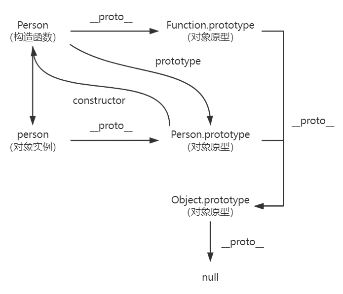

# 原型和原型链



## 对原型的理解？

在 JavaScript 中，每个对象都有 `__proto__` 属性，它指向对象的原型。（访问对象原型的标准方法是 `Object.getPrototypeOf()`）

使用原型的好处是所有由该原型衍生出来的对象共享它所包含的属性和方法。

## prototype 和 \_\_proto\_\_ 的区别？

* `prototype` 是函数的属性。当该函数作为构造函数创建一个新的对象时，会将 `prototype` 指向的对象作为新对象的原型。
* `__proto__` 是对象的属性，指向其原型。函数也有 `__proto__`，其指向 `Function.prototype`。
* 对象的 `__proto__` 与其构造函数的 `prototype` 指向的是同一个对象。

```javascript
function Person() {
}
let person = new Person();
console.log(person.__proto__ === Person.prototype); //true
console.log(Person.__proto__ === Function.prototype); //true
```

## constructor

对象原型的 `constructor` 属性指向关联的构造函数。例如：

```javascript
function Person() {
}
console.log(Person === Person.prototype.constructor); //true
```

## 什么是原型链？

原型链解决的主要是继承问题。

每个对象拥有一个原型，通过 `__proto__` 指向其原型，并从中继承方法和属性，同时原型也可能拥有原型，这样一层一层，最终指向 `null` (`Object.prototype.__proto__` 指向的是 `null`)。这种关系被称为原型链，通过原型链，一个对象可以拥有定义在其他对象中的属性和方法。

## 如何设置原型？

1. 使用 `Object.setPrototypeOf()` 静态方法可以将一个指定对象的原型（即 `__proto__` 属性）设置为另一个对象或者 `null`。

    ```javascript
    Object.setPrototypeOf(obj, prototype)
    ```

2. 使用 `Object.create()` 静态方法创建新的对象。它允许指定一个对象，将其作为新对象的原型。例如：

    ```javascript
    const personPrototype = {
    };
    const person = Object.create(personPrototype);
    console.log(person.__proto__ === personPrototype); //true
    ```
    >关于 `Object.create` 的更多信息可查看《[手写 Object.create 方法](./手写Object.create方法.md)》
3. 设置构造函数的 `prototype` 属性。

## 参考

1. [对象原型](https://developer.mozilla.org/zh-CN/docs/Learn/JavaScript/Objects/Object_prototypes)
2. [JavaScript 深入系列之从原型到原型链](https://github.com/yuanyuanbyte/Blog/issues/89)
